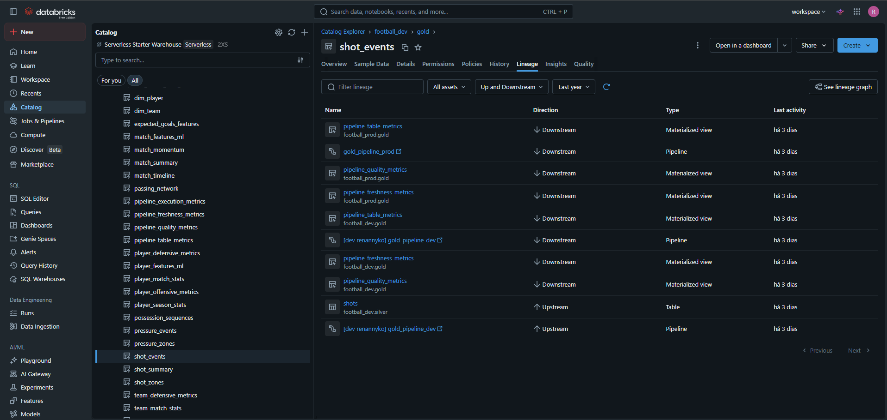

# Football Analytics Lakehouse

<p align="center">
  
</p>

<p align="center">
  Enterprise-Style Football Analytics Platform built with Databricks Lakehouse, Delta Live Tables, Unity Catalog, CI/CD, and Power BI Semantic Modeling.
</p>

---

# Executive Overview

The Football Analytics Lakehouse is a modern enterprise-style analytical platform built on Databricks using Lakehouse architecture principles, Medallion data modeling, declarative pipelines, metadata-driven engineering, and centralized governance.

The platform simulates real-world analytical engineering patterns commonly used in scalable enterprise data platforms while focusing on football analytics, tactical reporting, observability monitoring, semantic analytical serving, and future advanced analytics evolution.

The project uses StatsBomb Open Data as its primary source system and was intentionally designed to emphasize enterprise engineering best practices instead of isolated notebook experimentation.

---

# Project Goals

The platform was designed to achieve the following objectives:

- simulate a real-world enterprise Lakehouse platform
- implement scalable Medallion Architecture patterns
- demonstrate modern Databricks engineering practices
- build reusable analytical football datasets
- support tactical and scouting analytics
- implement governance and metadata management
- implement observability and monitoring patterns
- create Power BI semantic-ready datasets
- demonstrate CI/CD deployment automation
- prepare the platform for future advanced analytical evolution

---

# High-Level Architecture

<p align="center">
  
</p>

The platform follows a modern Medallion Architecture approach:

```text
StatsBomb Open Data
        │
        ▼
Unity Catalog Volumes
        │
        ▼
Bronze Streaming Tables
        │
        ▼
Silver Standardized Streaming Tables
        │
        ▼
Gold Analytical Serving Layer
        │
        ├── Power BI Dashboards
        ├── Tactical Analytics
        ├── Observability Layer
        └── Future Advanced Analytics
```

---

# Technology Stack

| Component | Technology |
|---|---|
| Lakehouse Platform | Databricks |
| Storage Layer | Delta Lake |
| Governance Layer | Unity Catalog |
| Pipeline Framework | Delta Live Tables |
| Orchestration | Lakeflow Jobs |
| CI/CD | GitHub Actions |
| Infrastructure Deployment | Databricks Asset Bundles |
| Source Control | GitHub |
| Development Environment | VS Code |
| BI Layer | Power BI |
| Primary Language | SQL |
| Source Dataset | StatsBomb Open Data |

---

# Medallion Architecture

## Bronze Layer

The Bronze layer preserves raw source fidelity and ingestion lineage.

### Main Responsibilities

- raw ingestion
- source preservation
- operational metadata
- ingestion lineage

### Main Tables

- raw_competitions
- raw_matches
- raw_lineups
- raw_events

---

## Silver Layer

The Silver layer standardizes and validates football event structures.

### Main Responsibilities

- event normalization
- semantic organization
- data quality enforcement
- specialized analytical structures

### Main Tables

- events
- shots
- passes
- carries
- dribbles
- pressures
- duels
- fouls
- goalkeeper_actions
- substitutions
- event_related_events

---

## Gold Layer

The Gold layer delivers analytical, tactical, semantic, and observability datasets optimized for Power BI and advanced analytical consumption.

### Main Responsibilities

- KPI generation
- tactical analysis
- semantic modeling
- observability monitoring
- advanced analytical preparation

### Main Analytical Domains

#### Match Analytics

- match_summary
- match_momentum
- match_timeline

#### Team Analytics

- team_match_stats
- team_season_stats
- team_offensive_metrics
- team_defensive_metrics

#### Player Analytics

- player_match_stats
- player_season_stats
- player_offensive_metrics
- player_defensive_metrics

#### Spatial Analytics

- shot_events
- pressure_events
- shot_zones
- pressure_zones

#### Tactical Sequence Analytics

- passing_network
- possession_sequences

#### Semantic Dimensions

- dim_match
- dim_team
- dim_player
- dim_match_time_window

#### Observability Models

- pipeline_table_metrics
- pipeline_freshness_metrics
- pipeline_quality_metrics
- pipeline_execution_metrics

---

# Databricks Pipeline Architecture

<p align="center">
  
</p>

The platform uses:

- Delta Live Tables (DLT)
- Streaming Tables
- Materialized Views
- Declarative SQL Pipelines
- Databricks Asset Bundles (DABs)
- Unity Catalog Governance
- Serverless Compute

---

# Governance Architecture

<p align="center">
  
</p>

The platform implements enterprise-grade governance patterns using Unity Catalog.

## Governance Capabilities

- semantic table comments
- TBLPROPERTIES metadata
- Unity Catalog TAGS
- metadata-driven discovery
- governance-as-code
- lineage visibility
- centralized governance

---

# Metadata-Driven Engineering

The platform heavily adopts metadata-driven engineering principles.

## Implemented Metadata Standards

### Table Comments

```sql
COMMENT "Gold analytical model containing player-level offensive KPIs."
```

### TBLPROPERTIES

```sql
TBLPROPERTIES (
    'data_domain' = 'football_analytics',
    'data_layer' = 'gold',
    'owner_team' = 'analytics_engineering'
)
```

### Unity Catalog TAGS

```sql
SET TAGS (
    'layer' = 'gold',
    'consumption_type' = 'power_bi'
)
```

---

# Data Quality Strategy

The Silver layer implements Delta Live Tables Expectations for data quality enforcement.

## Example

```sql
CONSTRAINT valid_event_id EXPECT (
    event_id IS NOT NULL
)
```

## Quality Objectives

- schema reliability
- semantic consistency
- downstream analytical integrity
- tactical analytical reliability

---

# Data Lineage and Observability

<p align="center">
  
</p>

The platform includes lightweight observability models directly inside the Lakehouse.

## Observability Datasets

- pipeline_table_metrics
- pipeline_freshness_metrics
- pipeline_quality_metrics
- pipeline_execution_metrics

## Monitoring Capabilities

- row count monitoring
- freshness validation
- quality validation
- execution health visibility

---

# CI/CD Architecture

<p align="center">
  
</p>

The platform uses GitHub Actions and Databricks Asset Bundles for deployment automation.

## Deployment Flow

```text
VS Code
    ↓
Git Commit
    ↓
Git Push
    ↓
GitHub Actions
    ↓
DEV Deployment
    ↓
Approval Gate
    ↓
PROD Deployment
```

## CI/CD Features

- automated validation
- DEV deployment automation
- PROD approval gate
- reproducible deployments
- governance-as-code
- environment isolation

---

# Production Deployment Approval Gate

<p align="center">
  
</p>

The deployment architecture includes:

- controlled production promotion
- manual approval workflows
- isolated environments
- deployment validation
- reproducible infrastructure deployment

---

# Power BI Semantic Modeling

<p align="center">
  
</p>

The Gold layer was intentionally designed for scalable semantic modeling inside Power BI.

## Semantic Design Principles

- reusable dimensions
- star-schema orientation
- semantic consistency
- analytical scalability
- tactical slicing capabilities

## Main Dimensions

- dim_match
- dim_team
- dim_player
- dim_match_time_window

## Main Consumption Domains

- executive dashboards
- tactical analysis
- scouting analysis
- spatial analytics
- observability analytics

---

# Dashboard Showcase

## Match Overview Analytics

<p align="center">
  
</p>

Main dashboard capabilities:

- match momentum tracking
- possession analysis
- team comparison
- tactical metrics
- player contribution analytics
- match event KPIs

---

## Tactical Analysis Visualization

<p align="center">
  
</p>

Custom tactical visualization using event coordinates and time-window segmentation for advanced spatial analysis.

---

## Defensive Pressure Zone Analysis

<p align="center">
  
</p>

Pressure zone analytics enable defensive intensity analysis and tactical positioning insights.

---

# Tactical Football Analytics

The platform includes advanced football analytical models including:

- passing networks
- possession sequences
- pressure zones
- shot zones
- momentum analysis
- offensive intensity indicators
- defensive intensity indicators

---

# Gold Analytical Models

The Gold layer includes specialized analytical models such as:

| Model | Description |
|---|---|
| match_summary | Match-level KPIs |
| match_momentum | Time-window momentum analysis |
| pressure_zones | Defensive pressure spatial analysis |
| passing_network | Team passing interaction analysis |
| player_match_stats | Player-level match performance |
| player_season_stats | Season aggregated player metrics |
| shot_events | Shot analytics |
| team_match_stats | Team performance KPIs |

---

# Repository Structure

```text
football-analytics-lakehouse/
│
├── .github/
│   └── workflows/
│
├── docs/
│   ├── architecture.md
│   ├── architecture-diagrams.md
│   ├── governance.md
│   ├── powerbi-semantic-model.md
│   └── images/
│
├── resources/
│   ├── bronze_pipeline.yml
│   ├── silver_pipeline.yml
│   ├── gold_pipeline.yml
│   └── orchestrator.job.yml
│
├── src/
│   ├── bronze/
│   ├── silver/
│   ├── gold/
│   └── ingestion/
│
├── databricks.yml
│
└── README.md
```

---

# Key Engineering Concepts

This project demonstrates practical implementation of:

- Medallion Architecture
- Streaming Data Engineering
- Declarative Pipelines
- Data Governance
- CI/CD for Data Platforms
- Semantic Modeling
- Tactical Sports Analytics
- Metadata Management
- Data Lineage
- Enterprise Data Architecture
- Analytics Engineering
- Lakehouse Design Patterns

---

# Architecture Documentation

Detailed documentation is available in:

| Document | Description |
|---|---|
| architecture.md | Enterprise platform architecture |
| architecture-diagrams.md | Mermaid architecture diagrams |
| governance.md | Governance and metadata strategy |
| powerbi-semantic-model.md | Power BI semantic modeling strategy |

---

# Future Enhancements

Potential future enhancements include:

- Machine Learning feature engineering
- Expected Goals (xG) modeling
- Real-time streaming ingestion
- Lakehouse Monitoring integration
- Data Quality dashboards
- Automated data observability
- Feature Store integration
- Advanced tactical clustering models

---

# Development Philosophy

This project was intentionally designed to simulate real-world modern data platform engineering practices including:

- enterprise governance
- modular architecture
- reusable analytical modeling
- CI/CD automation
- observability-first engineering
- semantic data modeling
- scalable analytical serving

---

# Conclusion

This project demonstrates how modern enterprise data engineering practices can be applied to sports analytics using the Databricks Lakehouse Platform.

The platform combines:

- scalable data architecture
- governance
- streaming pipelines
- CI/CD
- semantic modeling
- analytical storytelling

into a fully integrated analytics solution.

---

# Author

Renan Vitor Nyko

LinkedIn:  
https://www.linkedin.com/in/renannyko/

GitHub:  
https://github.com/renannyko