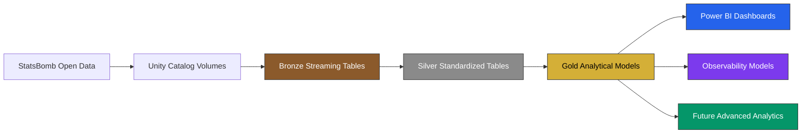
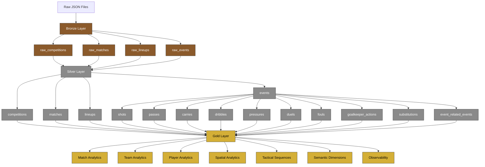
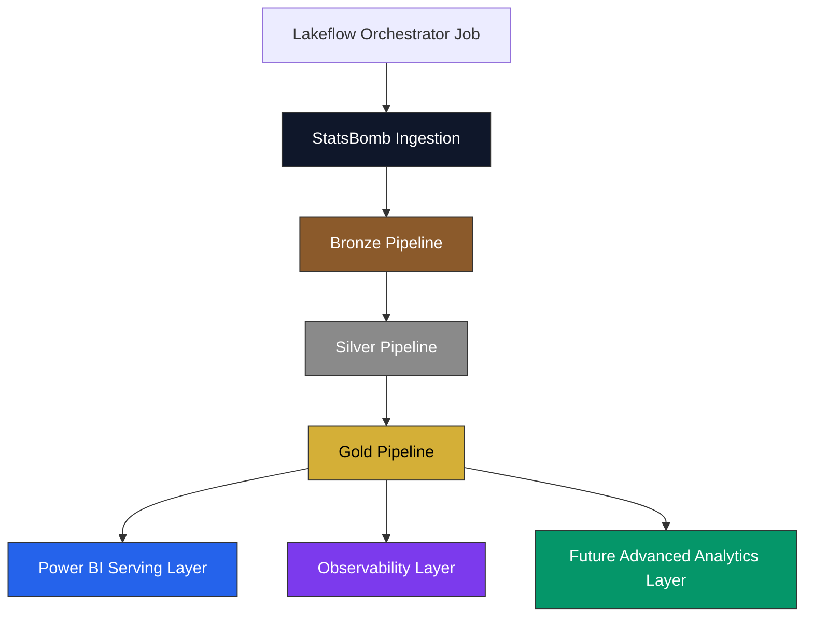
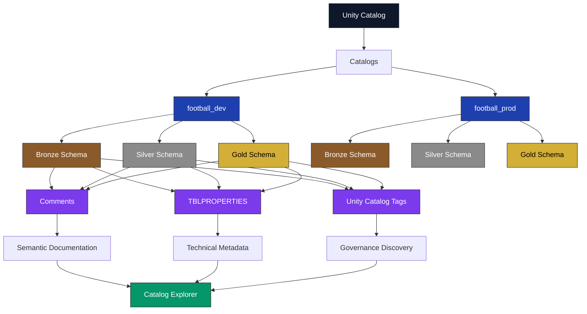
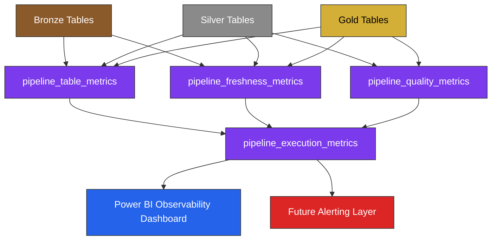
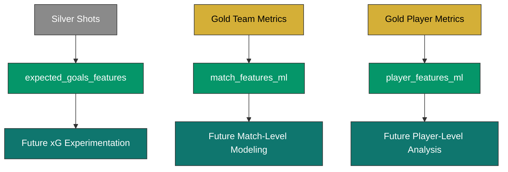

# Architecture Diagrams

## Football Analytics Lakehouse

---

# Overview

This document provides visual architecture diagrams for the Football Analytics Lakehouse platform.

The diagrams were created using Mermaid and are intended to support:

- technical documentation
- portfolio presentation
- architecture review
- recruiter and interviewer storytelling
- enterprise-style data platform communication

---

# 1. High-Level Lakehouse Architecture

---

# 2. Medallion Data Flow

---

# 3. Pipeline Orchestration Flow

---

# 4. Gold Analytical Domains

```mermaid
flowchart TD

    A[Gold Analytical Serving Layer] --> B[Match Analytics]
    A --> C[Team Analytics]
    A --> D[Player Analytics]
    A --> E[Spatial Analytics]
    A --> F[Tactical Sequence Analytics]
    A --> G[Semantic Dimensions]
    A --> H[Observability Models]
    A --> I[Advanced Analytics Preparation]

    B --> B1[match_summary]
    B --> B2[match_momentum]
    B --> B3[match_timeline]

    C --> C1[team_match_stats]
    C --> C2[team_season_stats]
    C --> C3[team_offensive_metrics]
    C --> C4[team_defensive_metrics]

    D --> D1[player_match_stats]
    D --> D2[player_season_stats]
    D --> D3[player_offensive_metrics]
    D --> D4[player_defensive_metrics]

    E --> E1[shot_events]
    E --> E2[pressure_events]
    E --> E3[shot_zones]
    E --> E4[pressure_zones]

    F --> F1[passing_network]
    F --> F2[possession_sequences]

    G --> G1[dim_match]
    G --> G2[dim_team]
    G --> G3[dim_player]
    G --> G4[dim_match_time_window]

    H --> H1[pipeline_table_metrics]
    H --> H2[pipeline_freshness_metrics]
    H --> H3[pipeline_quality_metrics]
    H --> H4[pipeline_execution_metrics]

    I --> I1[expected_goals_features]
    I --> I2[match_features_ml]
    I --> I3[player_features_ml]

    class A gold;
    class B,C,D,E,F,G goldDomain;
    class H observability;
    class I advanced;

    classDef gold fill:#D4AF37,color:#000,stroke:#333;
    classDef goldDomain fill:#FACC15,color:#000,stroke:#333;
    classDef observability fill:#7C3AED,color:#fff,stroke:#333;
    classDef advanced fill:#059669,color:#fff,stroke:#333;
```

---

# 5. Governance Architecture

---

# 6. Observability Architecture

---

# 7. CI/CD Deployment Flow

```mermaid
flowchart LR

    A[VS Code] --> B[Git Commit]
    B --> C[Git Push]
    C --> D[GitHub Repository]
    D --> E[GitHub Actions]

    E --> F[Validate DEV Bundle]
    E --> G[Validate PROD Bundle]

    F --> H[Deploy DEV]
    G --> I[Manual Approval Gate]

    I --> J[Deploy PROD]

    H --> K[Databricks DEV Target]
    J --> L[Databricks PROD Target]

    K --> M[DEV Validation]
    L --> N[Production Serving]

    A:::dev
    D:::github
    E:::actions
    H:::devDeploy
    I:::approval
    J:::prodDeploy
    K:::devEnv
    L:::prodEnv

    classDef dev fill:#334155,color:#fff,stroke:#333;
    classDef github fill:#111827,color:#fff,stroke:#333;
    classDef actions fill:#2563EB,color:#fff,stroke:#333;
    classDef devDeploy fill:#059669,color:#fff,stroke:#333;
    classDef approval fill:#F97316,color:#fff,stroke:#333;
    classDef prodDeploy fill:#DC2626,color:#fff,stroke:#333;
    classDef devEnv fill:#22C55E,color:#000,stroke:#333;
    classDef prodEnv fill:#B91C1C,color:#fff,stroke:#333;
```

---

# 8. Power BI Semantic Model

```mermaid
erDiagram

    dim_match ||--o{ match_summary : filters
    dim_match ||--o{ match_momentum : filters
    dim_match ||--o{ passing_network : filters
    dim_match ||--o{ player_match_stats : filters
    dim_match ||--o{ pressure_events : filters
    dim_match ||--o{ pressure_zones : filters
    dim_match ||--o{ shot_events : filters
    dim_match ||--o{ shot_zones : filters
    dim_match ||--o{ team_match_stats : filters

    dim_team ||--o{ match_momentum : filters
    dim_team ||--o{ passing_network : filters
    dim_team ||--o{ pressure_events : filters
    dim_team ||--o{ pressure_zones : filters
    dim_team ||--o{ shot_zones : filters
    dim_team ||--o{ team_match_stats : filters
    dim_team ||--o{ team_season_stats : filters

    dim_player ||--o{ player_match_stats : filters
    dim_player ||--o{ player_season_stats : filters
    dim_player ||--o{ pressure_events : filters
    dim_player ||--o{ pressure_zones : filters
    dim_player ||--o{ shot_zones : filters

    dim_match_time_window ||--o{ match_momentum : filters
    dim_match_time_window ||--o{ pressure_events : filters
    dim_match_time_window ||--o{ pressure_zones : filters
    dim_match_time_window ||--o{ shot_events : filters

    dim_match {
        int match_id
        string competition_name
        string season_name
        date match_date
        string match_result
    }

    dim_team {
        int team_id
        string team_name
    }

    dim_player {
        int player_id
        string player_name
        int team_id
        string team_name
    }

    dim_match_time_window {
        string match_time_window_key
        int match_id
        int minute_window_start
        int minute_window_end
        string minute_window_label
    }

    match_summary {
        int match_id
        int home_team_id
        int away_team_id
        string competition_name
    }

    match_momentum {
        int match_id
        int team_id
        string match_time_window_key
    }

    passing_network {
        int match_id
        int team_id
        int passer_player_id
        int recipient_player_id
    }

    player_match_stats {
        int match_id
        int player_id
        string player_name
    }

    player_season_stats {
        int player_id
        string player_name
        int team_id
    }

    pressure_events {
        int match_id
        int player_id
        int team_id
        string match_time_window_key
    }

    pressure_zones {
        int match_id
        int player_id
        int team_id
        string match_time_window_key
    }

    shot_events {
        int match_id
        string match_time_window_key
        boolean possession_distance_to_goal
    }

    shot_zones {
        int match_id
        int player_id
        int team_id
    }

    team_match_stats {
        int match_id
        int team_id
    }

    team_season_stats {
        int team_id
    }
```

---

# 9. Advanced Analytics Preparation Flow

---

# Conclusion

These architecture diagrams provide a visual representation of the Football Analytics Lakehouse platform across:

- data ingestion
- Medallion architecture
- pipeline orchestration
- analytical domains
- governance
- observability
- CI/CD
- Power BI semantic modeling
- future advanced analytics

They support the technical storytelling of the project and help communicate the platform as an enterprise-style modern data engineering solution.